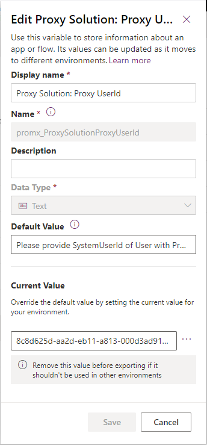

  

# Proxy for
# Project Operations Schedule API
## User Guide

A ready-to-use CRM solution to create an extra layer on top of Schedule API in order to impersonate any user you like 
with a Microsoft Project license. 

## Step-by-step guide  

1.  Import Proxy CRM solution into desired Environment in your Tenant. 
2.  Set value into Environment Variable ‘Proxy Solution: Proxy UserId’ to configure which User will be used for impersonation: 
    1.  Decide which System User with Microsoft Project License will be used to impersonate all requests coming from Application User(s) 
    2.  Obtain ID (Guid) of chosen System User, you will need it in a second. 
    3.  Open ‘Default Solution’ in the new (non-classic) UI as it’s the only way to access Environment Variables 
    4.  Locate Environment Variable named ‘Proxy Solution: Proxy UserId’ 
    5.  Update Variable’s ‘Current Value’, saving the ID of the chosen System User (see Figure 1) 
3.  In your code, instead of calling ‘msdyn_ExecuteOperationSetV1’ action directly, call ‘promx_ProxyExecuteOperationSetV1’; call signature is exactly the same. 

```csharp
private void CallExecuteOperationSetAction(string operationSetId) 
{ 
  //OrganizationRequest operationSetRequest = new OrganizationRequest("msdyn_ExecuteOperationSetV1"); 
  OrganizationRequest operationSetRequest = new OrganizationRequest("promx_ProxyExecuteOperationSetV1"); 
  operationSetRequest["OperationSetId"] = operationSetId; 
  OrganizationResponse response = organizationService.Execute(operationSetRequest); 
} 
```



Figure 1: updating Environment Variable

# Contact

For questions, wishes or feedback, please contact us via <support@proMX.net> or the below details. 
We encourage you to visit our [website](<https://www.proMX.net>) to find more.  

  
